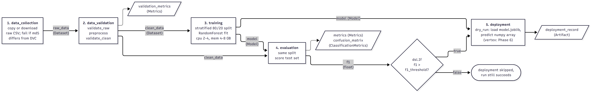
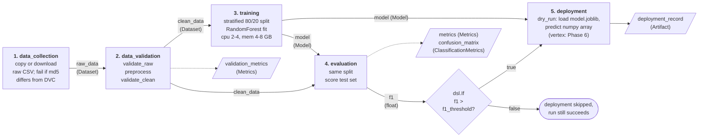

# Phase 5: Kubeflow pipeline

`pipeline/kfp_pipeline.py` defines the StayGuard workflow as a Kubeflow Pipelines (KFP v2) pipeline with five components, typed artifacts between them, and a condition that only lets deployment run when the evaluated F1 beats a threshold. It compiles to `pipeline/stayguard_pipeline.yaml`.

**Status, stated plainly.** The compiled YAML has never been submitted to a KFP or Vertex Pipelines cluster. Everything that was actually executed ran locally, either through KFP's own local runner or through a plain-Python simulation (see "Run modes").

## Components

All logic lives in the repo's `src/` package (installed as `stayguard`, see `pyproject.toml`); the component bodies are thin wrappers that import from it, so the pipeline and the DVC/MLflow code share one implementation.

| Component | Inputs | Outputs | What it does |
|---|---|---|---|
| data_collection | `source_uri`, `expected_md5` | `raw_data` (Dataset) | Copies the raw CSV (local path, or `gs://` via google-cloud-storage), checks its md5 against the DVC pointer (`5bf588c5...`), raises on mismatch, records rows and md5 as artifact metadata. |
| data_validation | `raw_data`, `adr_cap_quantile`, `top_n_countries` | `clean_data` (Dataset), `validation_metrics` (Metrics) | `validate_raw`, then `preprocess`, then `validate_clean`. Fails the run on any hard violation. |
| training | `clean_data`, `seed`, `n_estimators`, `mlflow_tracking_uri` | `model` (Model) | Stratified 80/20 split, RandomForest pipeline fit, `joblib.dump(compress=3)` to `<model>/model.joblib` (a directory holding `model.joblib`, what Vertex's sklearn container expects). Logs an MLflow run tagged `source=kfp_pipeline` only if a tracking URI is given. |
| evaluation | `clean_data`, `model`, `seed` | `f1`, `accuracy` (floats), `metrics` (Metrics), `confusion_matrix` (ClassificationMetrics) | Recomputes the same split and scores the test set. |
| deployment | `model`, `f1`, `deploy_mode`, `target_image` | `deployment_record` (Artifact) | `dry_run`: loads `model.joblib`, predicts a 2-row positional numpy array (how Vertex feeds it), writes a JSON record (model uri, f1, sklearn version, target container, timestamp). `vertex`: raises `NotImplementedError("wired in Phase 6")`. |

Preprocessing lives inside data_validation because the spec names exactly five components: that step is "validate, clean, re-validate" and acts as the data quality gate. The model and split come from `src/models.py` (extracted from `src/train.py`, which now imports it) so the components do not need mlflow or matplotlib.

## DAG



Source: `kubeflow_dag.mmd` (rendered with `npx -y @mermaid-js/mermaid-cli -i report/kubeflow_dag.mmd -o report/kubeflow_dag.png -b white -s 2 --size 2400`; pipeline parameters and their consumers are in the table below).



## Parameters

| Parameter | Default | Used by |
|---|---|---|
| source_uri | required | data_collection |
| expected_md5 | 5bf588c5a949443e021fb7c847d31b27 | data_collection |
| adr_cap_quantile | 0.995 | data_validation |
| top_n_countries | 10 | data_validation |
| seed | 42 | training, evaluation |
| n_estimators | 200 | training |
| mlflow_tracking_uri | "" (off) | training |
| f1_threshold | 0.60 | condition |
| deploy_mode | dry_run | deployment |

## The condition

`with dsl.If(evaluate.outputs["f1"] > f1_threshold, name="f1-above-threshold"):` wraps the deployment task. It compiles to a sub-DAG whose trigger policy is `inputs.parameter_values['pipelinechannel--evaluation-f1'] > inputs.parameter_values['pipelinechannel--f1_threshold']`. If it is false the sub-DAG is skipped and the pipeline still succeeds (it just does not deploy). Caching: data_collection and deployment have caching off (external state, timestamped record); the rest use KFP's default so an unchanged step with unchanged inputs is reused. Training requests 2 CPU / 4 GB and is limited to 4 CPU / 8 GB.

## Run modes

| Mode | What it is | Ran? |
|---|---|---|
| Compiled YAML (`python -m pipeline.kfp_pipeline compile`) | The artifact for a real KFP or Vertex Pipelines cluster. Each step is a `python:3.11-slim` container that pip-installs this repo from GitHub. | Compiled and parsed only. **Not submitted anywhere.** |
| KFP local runner (`--mode kfp-local`) | KFP's own `kfp.local.SubprocessRunner`: the same pipeline function is compiled in memory (with `packages_to_install=[]`, so not the committed YAML byte for byte) and executed, each component in its own Python subprocess, artifacts passed via KFP's artifact store, `dsl.If` evaluated. Not a cluster: no containers, no base image, no resource limits, no scheduler. | Yes |
| Plain simulation (`--mode simulate`) | Calls each component's original Python function in order with small artifact stand-ins and applies the F1 condition in Python. No KFP runtime. Fast demo. | Yes |

Local setup facts (all handled in `pipeline/run_local.py`):

- **packages_to_install.** The compiled YAML installs `stayguard @ https://github.com/rakshitha-manoj/StayGuard/archive/<ref>.zip` (an archive URL, because `python:3.11-slim` has no git binary for `git+https://`). For local runs the components are rebuilt with `packages_to_install=[]` and `install_kfp_package=False`, so no pip command runs at all and the venv cannot be modified; `src` comes from `pip install -e .`. With `use_venv=False` the runner would otherwise run the install commands against the active environment. `uv pip freeze` before and after the whole exercise differs only by the added editable `stayguard`.
- **Two kfp 2.16 local-runner problems, patched in-process only (no library file edited):**
  1. On Windows the runner breaks `sh -c` commands (backslashes in the interpreter path and in artifact paths inside the executor-input JSON). `run_local.py` rewrites them to forward slashes. Needs `sh` on PATH (Git for Windows).
  2. The runner's condition evaluator (`kfp/local/orchestrator/enhanced_dag_orchestrator.py`, `ConditionEvaluator`) cannot evaluate the condition `dsl.If` compiles to, on any OS. It only recognises task-output channels written `<task>--<output>` or `<task>-Output`, so it treats `evaluation-f1` as a missing parent input; and even when a channel does resolve it leaves the `inputs.parameter_values[...]` wrapper in the expression, so `eval` fails with `NameError: name 'inputs' is not defined`. Either way it returns False and deployment is skipped silently even when F1 clears the threshold. A minimal pipeline with one float-returning component and `dsl.If(op.output > 0.5)` shows the same failure under the stock runner (gated step never runs for 0.7) and the correct behaviour with the patch (runs for 0.7, skipped for 0.3), so this is a kfp bug, not how this pipeline uses `dsl.If`. `run_local.py` replaces `ConditionEvaluator.evaluate_condition` with one that resolves the channels and evaluates the comparison, and prints the evaluated expression. So the condition in kfp-local is verified by KFP's DAG execution plus this patched evaluator, not by stock KFP.

## Captured local runs (RF, v2-clean, seed 42, this machine)

KFP local runner, threshold 0.60 (condition true):

```
dsl.If condition `0.6767003676470589 > 0.6` -> True
StayGuard pipeline summary  (mode=kfp-local, f1_threshold=0.6)
  data_collection  ok
  data_validation  ok
  training         ok
  evaluation       ok
  deployment       ok
  f1=0.6767 accuracy=0.8359
  clean_data md5 0bd1d2070641efd38a0d1f526532b8da
  deployment ran: True
```

KFP local runner, `--f1-threshold 0.99` (condition false):

```
dsl.If condition `0.6767003676470589 > 0.99` -> False
  data_collection  ok
  data_validation  ok
  training         ok
  evaluation       ok
  deployment       skipped (condition false: f1 0.6767 <= 0.99)
  f1=0.6767 accuracy=0.8359
  deployment ran: False
```

Plain simulation, threshold 0.99 then 0.60 (per-step timings):

```
mode=simulate, f1_threshold=0.99          mode=simulate, f1_threshold=0.6
  data_collection  ok (2.7s)                data_collection  ok (1.1s)
  data_validation  ok (3.9s)                data_validation  ok (2.2s)
  training         ok (29.4s)               training         ok (26.0s)
  evaluation       ok (3.2s)                evaluation       ok (5.2s)
  deployment       skipped (f1 0.6767 <= threshold 0.99)    deployment  ok (4.0s)
```

Deployment record from the positive branch: `mode=dry_run`, `model_size_mb=65.0`, `n_features=69`, `sample_prediction=[0, 0]`, `sklearn_version=1.6.1`, `target_container_uri=us-docker.pkg.dev/vertex-ai/prediction/sklearn-cpu.1-6:latest`.

md5 gate, `--expected-md5 deadbeef` (both modes fail at step 1, nothing downstream runs):

```
RuntimeError: raw data md5 mismatch for .../hotel_bookings.csv: expected deadbeef, got 5bf588c5a949443e021fb7c847d31b27. Refusing to continue with unexpected data.
```

Consistency checks: the in-pipeline preprocessing reproduced the DVC `v2-clean` file byte for byte (md5 `0bd1d2070641efd38a0d1f526532b8da`, 85,716 x 70), and test F1 0.6767003676470589 / accuracy 0.8359 equal the Phase 3 `rf__v2-clean` result. Four separate runs (two modes, two thresholds) produced the identical F1 to all 16 digits. A run with `--mlflow-tracking-uri` logged an `rf__kfp_pipeline` run tagged `source=kfp_pipeline` with the same `test_f1` (tested against a throwaway SQLite DB, not the project's `mlflow.db`).

## How automation improves reproducibility

- **Versioned code.** Components install the repo at a git ref fixed at compile time. `main` is a moving target; compile with `--ref <commit-sha>` or a tag so the YAML always runs the exact code.
- **Versioned data.** The first step refuses any file whose md5 differs from the one in the DVC pointer, and the cleaned data's md5 is recorded on the artifact, so a run can state which dataset it used.
- **Versioned parameters.** Seed, hyperparameters, preprocessing parameters and the threshold are pipeline parameters stored with each run, not edited into scripts.
- **Identical reruns.** Fixed seeds, the same split function in training and evaluation, and a deterministic preprocess give bit-identical F1 (shown above). Caching lets an unchanged step be reused instead of recomputed.
- **Lineage.** KFP records which artifact each task consumed and produced (raw_data to clean_data to model to metrics), and the optional MLflow tag `source=kfp_pipeline` links an experiment-tracker run back to the pipeline.

## How automation improves scalability

- **Containerized steps.** Each step runs in its own container image, so steps scale and fail independently and do not depend on one machine's environment.
- **Cluster resources.** Per-step requests and limits (training asks 2-4 CPU, 4-8 GB here) let the scheduler place heavy steps on suitable nodes; GPUs or larger machines are a one-line change.
- **Parallelism.** Independent branches run concurrently. A natural extension is `dsl.ParallelFor` over the three model families (RF, LinearSVC, KNN) with a final pick-best step; not implemented.
- **Scheduled retraining.** A recurring run (KFP recurring runs, or a Vertex Pipelines schedule) can retrain on new data; the Phase 6 drift monitor could trigger it. Not set up yet.

## Honest limitations

- The pipeline has not been run on a KFP or Vertex cluster, so base-image behaviour, the GitHub install inside the container and cluster resource limits are untested.
- The `gs://` branch of data_collection has never been exercised.
- `deploy_mode="vertex"` raises `NotImplementedError` until Phase 6.
- `packages_to_install` pulls from GitHub: the cluster needs internet access and the code must already be pushed at the chosen ref. With `main`, the code that runs is whatever main is at that moment.
- The local runner needed the two patches described above: stock kfp 2.16 on Windows cannot start the steps, and on any OS its `dsl.If` evaluation always skips the gated step.
- The MLflow run is logged by training in local mode only; on a cluster the tracking URI defaults to empty.
