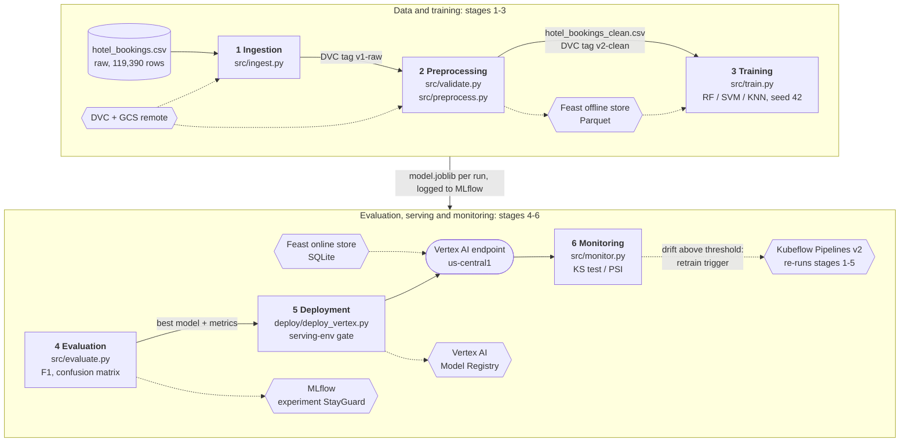
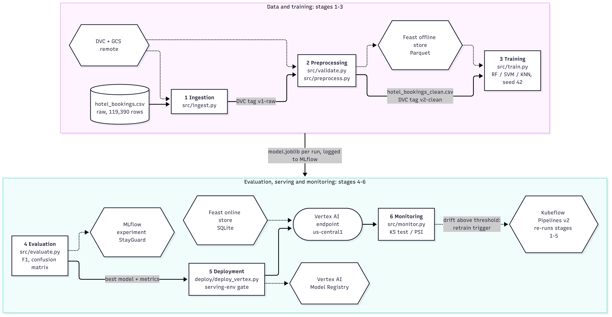

# StayGuard ML lifecycle design

StayGuard predicts whether a hotel booking will be canceled (`is_canceled`) from the Kaggle "Hotel booking demand" data: 119,390 bookings, 32 columns, about 37% canceled (44,224 canceled vs 75,166 kept). A one-off notebook model would not survive contact with reality: the data gets cleaned in several ways, several model families get compared, the booking mix drifts over time, and a deployed endpoint costs money. MLOps gives each of those a versioned, repeatable, monitored home. This document is the **design** of that lifecycle; nothing below has been run yet, and no results are claimed. Implementation status per stage is "planned (Phase N)".

## Lifecycle diagram

The top row is data and training (stages 1-3), the bottom row evaluation, serving and monitoring (stages 4-6); the drift trigger re-runs the Kubeflow pipeline from stage 1. Solid arrows are the artifact flow; dotted arrows are supporting tools and the feedback loop. The same source lives in `lifecycle.mmd`, and the PNG is rendered from it with mermaid-cli.

## Stage table

| Stage | Purpose | Tool(s) | Input artifact | Output artifact | Owner script |
|---|---|---|---|---|---|
| 1. Data ingestion | Load the raw bookings and pin an exact, restorable version | DVC (GCS remote `gs://stayg-510316-stayguard-dvc/dvcstore`), git tag `v1-raw` | `data/raw/hotel_bookings.csv` (119,390 x 32) | DVC-tracked raw dataset (`hotel_bookings.csv.dvc`), tag `v1-raw` | `src/ingest.py` |
| 2. Preprocessing | Validate, clean and encode the data; serve consistent features | `dvc.yaml` stages (`dvc repro`), Feast (`feature_repo/`), git tag `v2-clean` | Raw dataset at `v1-raw` | `data/processed/hotel_bookings_clean.csv`, tag `v2-clean`, Feast Parquet offline and SQLite online stores | `src/validate.py`, `src/preprocess.py` |
| 3. Training | Fit and compare three model families reproducibly | scikit-learn 1.6.1 (RandomForest, SVM, KNN), MLflow experiment `StayGuard` | Dataset at `v1-raw` and at `v2-clean` | One MLflow run per model and data version (params, data tag, metrics, model artifact) | `src/train.py` |
| 4. Evaluation | Measure, compare and pick the best model | MLflow (`mlflow.search_runs()`), scikit-learn metrics | MLflow runs, held-out test split | Accuracy/precision/recall/F1, confusion matrices, comparison table, overfitting flags, selected `model.joblib` | `src/evaluate.py` |
| 5. Deployment | Serve the chosen model behind an online endpoint | Vertex AI Model Registry and Endpoints, prebuilt `sklearn-cpu.1-6` container (us-central1, project `stayg-510316`) | `model.joblib` of the best run | Registered Vertex model, live endpoint, sample prediction | `deploy/deploy_vertex.py`, `deploy/predict_sample.py`, `deploy/teardown.py` |
| 6. Monitoring | Detect data drift and trigger retraining | KS test and PSI (Vertex AI Model Monitoring as the managed alternative), Kubeflow Pipelines | Reference data vs newer months of `lead_time`, `adr`, `previous_cancellations` | Drift report and a retraining trigger that re-runs the pipeline | `src/monitor.py` |

Orchestration spans stages 1 to 5: `pipeline/kfp_pipeline.py` compiles to `pipeline/stayguard_pipeline.yaml`.

## Stage details

### 1. Data ingestion (planned, Phase 2)
`src/ingest.py` loads `data/raw/hotel_bookings.csv`, and the file is versioned with DVC against a GCS remote, so git only stores a small `.dvc` pointer. Tag `v1-raw` marks the untouched data, so later experiments can say exactly which bytes they trained on. The class balance (about 37% canceled) is noted here because it drives later choices.

### 2. Preprocessing (planned, Phase 2)
`src/validate.py` runs schema, null and range checks and fails loudly rather than letting bad data flow on. `src/preprocess.py` drops the leaky columns `reservation_status` and `reservation_status_date` (they reveal the outcome), imputes nulls in `children`, `country`, `agent` and `company`, removes zero-guest rows and negative `adr`, caps `adr` outliers, engineers `total_nights` and `total_guests`, and encodes categoricals. The result is `hotel_bookings_clean.csv` (tag `v2-clean`), rebuilt by `dvc repro`. Feast (planned, Phase 4) exposes `lead_time`, `adr` and `previous_cancellations` per `booking_id`, giving training and inference one definition of each feature.

### 3. Training (planned, Phase 3)
`src/train.py` trains RandomForest, SVM and KNN with scikit-learn 1.6.1 and seed 42. The train/test split is stratified so both sets keep the roughly 37% positive rate; an unstratified split could shift it and distort recall and F1. Each run is logged to the MLflow experiment `StayGuard` with parameters, the data version tag, metrics and the model artifact. Every model is trained on both `v1-raw` and `v2-clean` so the effect of cleaning is measured, not assumed.

### 4. Evaluation (planned, Phase 3)
`src/evaluate.py` computes accuracy, precision, recall and F1, draws the confusion matrix and builds a comparison table from `mlflow.search_runs()`. Because cancellations are the minority class, F1 and recall matter more than accuracy alone. A large train/test gap flags overfitting, and the best model is selected from the table.

### 5. Deployment (planned, Phase 6)
`deploy/deploy_vertex.py` uploads `model.joblib` to the Vertex AI Model Registry using the prebuilt container `us-docker.pkg.dev/vertex-ai/prediction/sklearn-cpu.1-6:latest` and deploys it to an endpoint in us-central1. Before upload, a gate checks that the model loads in the serving image's environment (Python 3.10, numpy 1.26.4): a model that loads locally can still fail inside the container, and finding that out after a slow, billed deployment is avoidable. `deploy/predict_sample.py` sends a test request and `deploy/teardown.py` removes the resources.

### 6. Monitoring (planned, Phase 6)
`src/monitor.py` compares a reference window against newer months for `lead_time`, `adr` and `previous_cancellations` using a KS test and PSI; these features shift with seasons and booking behaviour. Drift above a threshold triggers a retraining run of the pipeline, closing the loop. Vertex AI Model Monitoring is the managed alternative.

## Orchestration and implementation status

Kubeflow Pipelines v2 (`pipeline/kfp_pipeline.py`) chains data_collection, data_validation, training, evaluation and deployment; deployment runs only if the best F1 is at least a threshold. A local simulation mode runs the same steps without a cluster.

| Component | Status |
|---|---|
| Ingestion, preprocessing (DVC, `dvc.yaml`) | planned (Phase 2) |
| Training, evaluation (MLflow) | planned (Phase 3) |
| Feast feature store | planned (Phase 4) |
| Kubeflow pipeline | planned (Phase 5) |
| Deployment, monitoring (Vertex AI) | planned (Phase 6) |

## Cross-cutting concerns

- **Reproducibility:** seed 42 everywhere (`src/utils.py`), pinned dependencies in `requirements.txt` (scikit-learn 1.6.1 to match the serving image), DVC content hashes for data, and git tags `v1-raw` and `v2-clean`.
- **Lineage:** each MLflow run records its data version tag and the git commit, so a deployed model traces back to the run, the exact data and the exact code.
- **Orchestration:** Kubeflow Pipelines makes stage order and the F1 deployment condition explicit and re-runnable, which is also what the drift trigger calls.
- **Cost control:** Vertex endpoints bill while deployed, so `deploy/teardown.py` removes the endpoint and model, and `deploy/teardown_bucket.ps1` removes the DVC bucket.
